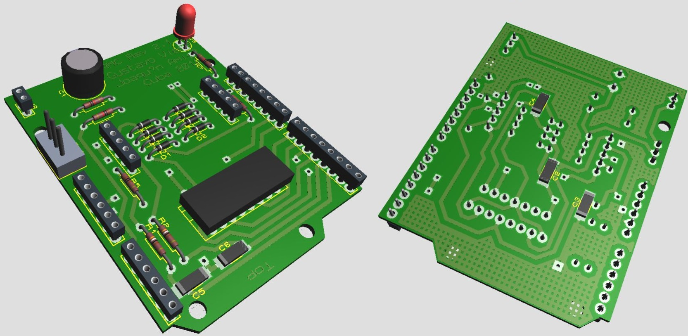

DC Motor Driver
===============

This project is a Dual DC motor driver compatible with Rosie platform. It includes both: the hardware design of an Arduino shield and the firmware to use it.

#

To have up and running this project you will need:
* Arduino UNO (or any other with the ATMega328 microcontroller)
* DC motor(s) with encoder
* Manufacture the shield

The main features are:
----------------------

* PID speed control
* USB communication protocol
* Low-pass filtering in the encoders signal

The main limitations are:
-------------------------

* No support for quadrature encoders
* No information about the current consumption

**Note:** New versions of the board will solve both limitations.

Manufacturing the shield
------------------------
* Buy all components in *component_list.txt*
* Print the dual layer PCB using *top.pdf* and *bottom.pdf*
* Soldier the components as shown in *silk.pdf*

**Note:** We produce this board in Cuba without Hardware Stores or Online Shopping. Believe us, is not that hard.

Selecting the motors
--------------------
* The driver is compatible with any DC motor with operating voltage below 24V. You will need to plug 5 wires:
1. Motor (+)
2. Encoder Signal
3. Encoder GND
4. Encoder VCC
5. Motor (-)

**Note:** We made all the tests of this controller using [this](https://www.robot-italy.com/it/gearmotor-12vdc-62rpm-encoder.html) kind of motors.

Testing the driver
------------------
You can easily test the driver by selecting 'ArduinoMD' in your robot profile inside rosie. Otherwise you can use the driver standalone using the script 'ArduinoMD.py' contained in the rosie project.

